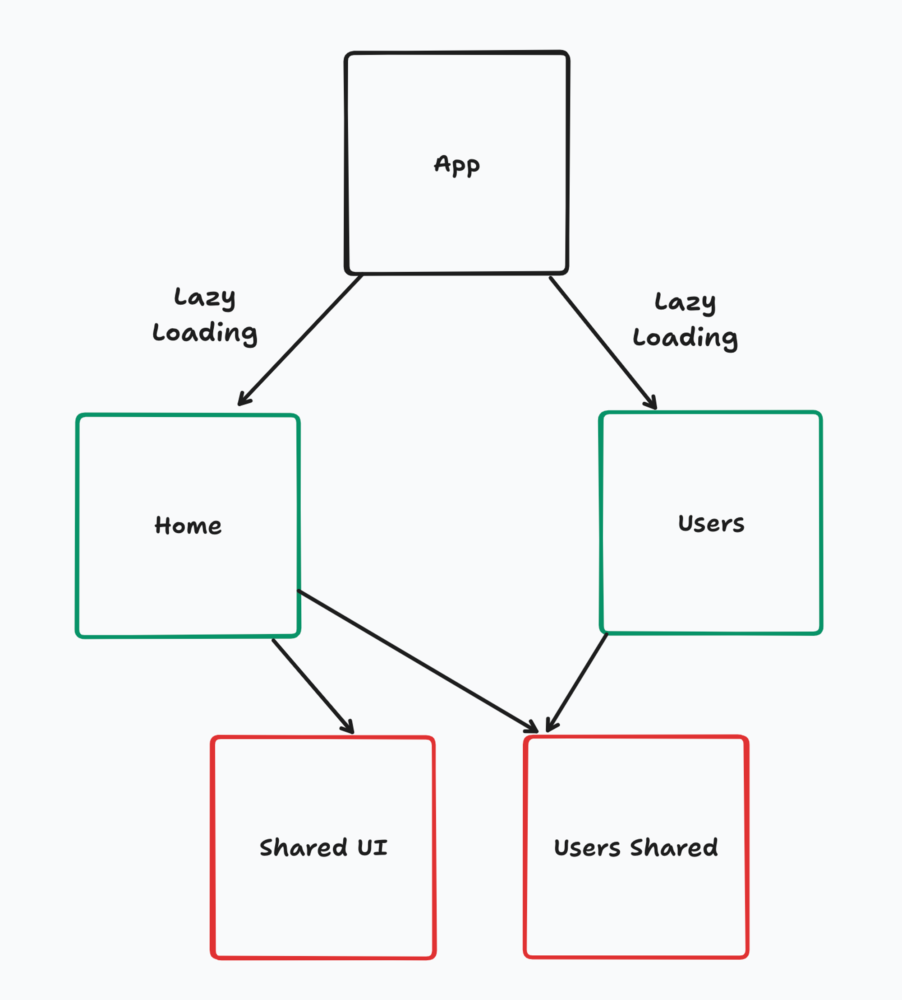

# Arquitetura Angular

### Instalando o Angular CLI

```bash
npm install -g @angular/cli
```

### Criando nosso projeto

```bash
ng new workshop-angular
```

### Como estruturar o projeto?
- Conhecendo o Angular Style Guide: https://angular.dev/style-guide#

#### Começando a estruturar uma app de grande porte



#### Componente da HomePage

```bash
ng g c home
```

#### Componente de Usuários

```bash
ng g c users
```

#### Service Shared de Usuário

```bash
ng g s users/shared/user
```

#### Componente Shared

```bash
ng g c shared/components/header
```

#### Definindo Lazy Loading

Técnica de otimização para carregar recursos de forma assíncrona ou sob demanda. 
Em aplicações modernas, não existe desculpa para não utilizar Lazy Loading.

## Arquitetura para projetos muito grandes

> Arquitetura **NÃO** é estrutura de pastas!
 

A arquitetura de software é a estrutura fundamental que define a **organização**, **interação** e **princípios de design** de um sistema. Ela delineia como os componentes do sistema são divididos, como interagem entre si e como são implementados e distribuídos.